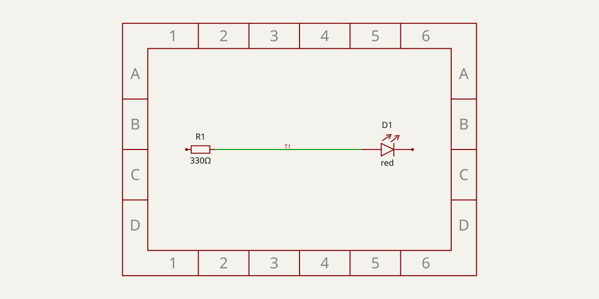

# Bedroom clock




A bedroom clock that shows the time in 24 h format on four large 7-segment digits and plays a song as an alarm with slowly rising volume. PCB design written in [tscircuit](https://tscircuit.com) (React/TSX, compiled by the `tsci` CLI). This file is the project doc: the brief (requirements), then design decisions and status, kept current as the design evolves.

## System overview

Two boards:

1. **LED board** (this repo, `index.circuit.tsx`): the four digits. Every digit is 7 segments (bars) of 10 WS2812-type LEDs in a line; a bar is 50 mm long, a digit is about 120 mm high and 65 mm wide (bars separated by ~3 mm gaps, like discrete bars on a sign). All LEDs sit on one daisy-chained data line. Connected to the controller board with **3 wires: 5V, GND, DIN**, soldered to pads.
2. **Controller board** (not designed yet): ESP32-S3 mini dev board (extended, 18-pin version, if the pins suffice), an MP3 player module with SD card socket, the 5V power input, the 3.3 V to 5 V data level shifter and the amplifier/speaker connection.

Firmware (not in this repo): custom, web UI written in Svelte and embedded with the `svelteesp32` library, with a Wi-Fi settings portal (time, alarm, song, volume ramp, brightness).

## Status

- LED board: **one digit** (70 LEDs) designed, plus the 3-wire entry. `npm run check:full` passes (netlist, schematic placement, placement DRC, build, no shorts). Fabrication outputs export (BOM: 70 LEDs + 1 capacitor).
- Next: instantiate the digit four times (+ optional colon), chain DOUT to DIN between digits, design the controller board.

## Requirements

- **Purpose:** LED board for the clock digits: 4 x 7-segment digits built from WS2812-type RGB LEDs (2.0 x 1.8 mm), 10 LEDs per segment, 5 cm segment length, bars not overlapping (horizontals between the vertical columns, verticals between the horizontals, ~3 mm gaps), so about 120 mm digit height, one data line. Brightness/colour set by firmware.
- **Board size / form factor:** first step: one digit, 70 x 124 mm, 2 layers, all SMD parts on the top side. (Four digits: about 4 x 70 mm wide, digit pitch to be chosen, see Open questions.)
- **Power sources and rails:** 5 V only, fed through the 3 wires from the controller board. Current budget: see Design notes.
- **I/O (connectors, headers, mounting holes):** 3 plated wire pads on the left edge (hand-soldered, no connector): DIN (top), 5V (middle), GND (bottom). No mounting holes yet (Open questions).
- **Mechanical constraints:** the digit outline is fixed by the 5 cm bars: LED rows of the horizontal bars at y = +57.6 / 0 / -57.1 mm (x = -22.5..22.5), vertical bars at x = +-28.5 mm (centre lines), upper LEDs y = 6.6..51.6, lower -51.1..-6.1. Enclosure not defined yet.
- **Manufacturer and constraints:** JLCPCB; basic parts where one exists; Economic assembly (only parts marked "PCBA Type: Economic and Standard", never "Standard Only"; top side only).

## Design notes

### Parts

| Ref | Part | JLCPCB | Why |
| --- | --- | --- | --- |
| U1..U70 | XL-0807RGBC-2812B (XINGLIGHT), 2.0 x 1.8 mm, 5 V, WS2812B protocol | C3646929 | Chosen by the user. Economic and Standard, ~58 k in stock. (Other 2020 WS2812 variants such as WS2812C-2020-V1, C2976072, are "Standard Only".) |
| C1 | 22 uF 25 V X5R 0805 | C45783 | Bulk capacitor at the wire entry. Basic, Economic. |
| J1 | 3 plated holes (1.0 mm drill, 2.0 mm pad, 2.54 mm pitch) | - | Wire pads; `doNotPlace`, not in BOM. |

LED pinout (verified from the EasyEDA symbol/footprint): pin1 DOUT, pin2 GND, pin3 DIN, pin4 VDD; pads 0.8 x 0.8 mm at +-0.889 / +-0.575 mm. The footprint is a local `<footprint>` copied from that part (`lib/Ws2812Led.tsx`), because `jlcpcb:` footprints hit EasyEDA 403 rate limits.

### Digit geometry and data chain

Digit frame: origin = digit centre, x right, y up (the PCB image is in this orientation).

The bars are chained so the data enters at the middle left and leaves at the middle right (good for chaining digits left to right):

| Order | Bar | LEDs | First LED at (x, y) mm | Direction |
| --- | --- | --- | --- | --- |
| 1 | f (upper left) | U1-U10 | (-28.5, 6.6) | up |
| 2 | a (top) | U11-U20 | (-22.5, 57.6) | right |
| 3 | b (upper right) | U21-U30 | (28.5, 51.6) | down |
| 4 | c (lower right) | U31-U40 | (28.5, -6.1) | down |
| 5 | d (bottom) | U41-U50 | (22.5, -57.1) | left |
| 6 | e (lower left) | U51-U60 | (-28.5, -51.1) | up |
| 7 | g (middle) | U61-U70 | (-22.5, 0) | right |

LED pitch 5 mm, so a bar is 10 LEDs over 50 mm. **Firmware segment map** (LED index = U number - 1): a = 10..19, b = 20..29, c = 30..39, d = 40..49, e = 50..59, f = 0..9, g = 60..69. DIN = U1.DIN, DOUT = U70.DOUT (left unconnected for now). 70 LEDs x 24 bit at 800 kbit/s = 2.1 ms per frame per digit.

### Power

- 5 V rail on each bar: a 0.5 mm trace on the inner side of the LED row joins the VDD pads; 0.5 mm links join the bars at the corners, following the data chain. The 5V wire pad feeds the start of the chain (U1, bar f) and the other bars are powered in series along the chain, every link following the data order (the 5V links run through the gaps between the bars). Estimated worst-case drop at full white along the whole digit is well below 0.3 V; the firmware limits brightness anyway.
- GND: bottom layer is a solid GND pour (`<copperpour>`), every LED GND pad has its own via (0.3/0.6 mm) next to it; the GND wire pad sits in the pour.
- LED current is **not yet verified** against the XL-0807 datasheet; assuming up to ~20 mA per LED at full white: ~1.4 A per digit, ~5.6 A for four digits. A single 0.5 mm 5V trace carries 1 A at ~10 C rise (1 oz), so the firmware must cap the total brightness (a lit digit at 25 % is ~0.2 A) until the budget is settled, see Open questions.
- Decoupling: only the 22 uF bulk capacitor at the entry (the user decided against a capacitor per LED). If flicker or data glitches show up, a 100 nF per LED is the usual fix; the cells have room below the 5V rail.
- Data: WS2812 inputs need VIH of about 0.7 x VDD (3.5 V at 5 V), so the ESP32 (3.3 V) needs a level shifter (e.g. 74AHCT1G125) plus a ~330 ohm series resistor **on the controller board** (not on this board).

### How the copper is made

The digit is routed explicitly, not by the autorouter (`<board routeRemaining={false}>`), so the pattern is the same for every LED and independent of autorouter luck:

- `lib/LedSegment.tsx`: one bar = 10 LEDs in a row, built with `pcbPath` traces (5V rail, data hop between neighbours, GND via).
- `lib/SevenSegDigit.tsx`: places the 7 bars (LEDs at absolute board positions and rotations; there are no `<group>`s anywhere) and joins them with explicit corner links (`LINKS`). The e to g data link hops under the 5V link on the bottom layer.
- `index.circuit.tsx`: the board, the wire pads J1, the bulk capacitor C1 and their traces.
- A trace's `pcbPath` points are expressed in the **frame of the component that owns the `from` port** (its position and rotation), not in board or group coordinates. `lib/SevenSegDigit.tsx` converts digit coordinates into that frame (`toLed`).
- A via inside a `pcbPath` needs a wire point at the same spot before and after it (only used at the end of a path here: the GND vias).
- Capacitors also get a default 1 mm "decoupling" max trace length; `C1` sets `maxDecouplingTraceLength`.

## Decisions

- **LED part:** user's choice, C3646929 (Economic assembly OK). Local footprint; 3D model: the EasyEDA model of C3646929 via modelcdn (`objUrl`).
- **No per-LED capacitor** (user decision): a bar is just 10 LEDs. Only a 22 uF bulk capacitor at the entry.
- **One data chain through all LEDs** and **3 wires** only (5V, GND, DIN) between the two boards (user decision).
- **Two layers, top-side parts only** to keep Economic assembly and a cheap board; GND on the bottom pour instead of a second 5V/GND layer pair. Rejected: 4 layers (cost, not needed for the current budget).
- **Explicit routing** instead of the autorouter: the autorouter produced tangled, uneven copper and tried to connect GND pad to pad on top.
- **Bars like discrete bars with gaps** (user, from a photo of a laser-cut board with separate bar PCBs): no shared corners, ~3 mm gaps, so the corner links pass through the gap and nothing collides. Replaces the first version where the vertical bars ran into the horizontal rows (100 mm figure-8). Costs height: ~120 mm instead of 100 mm.
- **Chain order f-a-b-c-d-e-g** instead of alphabetical, so DIN and DOUT are both at mid height on the left/right.
- **5V link b to c stays on top**; it blocks the straight exit of U70.DOUT to the next digit, which will hop under it on the bottom layer when the digits are chained.
- **Solder pads, no connector** for the wire entry (user decision).

## Open questions / TODO

- Verify the LED current per colour from the XL-0807RGBC-2812B datasheet and set the real power budget (supply size, trunk width, firmware brightness cap).
- Four-digit board: digit pitch, optional colon dots (24 h clock), how DOUT of each digit reaches the next DIN, where the 3 wire pads go, mounting holes, diffuser/enclosure.
- With 4 digits drawing up to ~5 A through one thin 5V wire pad and a single trunk entry: decide on thicker copper or extra 5V/GND pads (user said 3 wires; a thicker wire per pad is possible).
- Check the LED rotation in the JLCPCB assembly preview before ordering (`tsci export` warns "cannot verify jlcpcb pick-and-place rotation"; the LEDs are exported at 270 deg / 180 deg depending on the bar).
- Silkscreen labels for the wire pads (DIN, 5V, GND) are missing; currently documented only here and in the schematic.
- Controller board: which MP3 module (DFPlayer-style with SD socket?), amplifier and speaker, 5V input connector, ESP32-S3 pin plan, level shifter.

## Finding JLCPCB parts

Query the [jlcsearch](https://jlcsearch.tscircuit.com/) JSON API (e.g. `leds/list.json`, `led_with_ic/list.json`, `capacitors/list.json`, `components/list.json?search=...`). Prefer basic parts (`is_basic=true`) and pick the highest stock. Then open the part page (`https://jlcpcb.com/partdetail/C<number>`) and confirm it says `PCBA Type: Economic and Standard`; jlcsearch does not expose this flag. Record the chosen part as `supplierPartNumbers={{ jlcpcb: ["C..."] }}` in the TSX. Also browse [tscircuit datasheets](https://tscircuit.com/datasheets).

## Setup

Requires Node and [Bun](https://bun.sh) (`tsci` runs under Bun; make sure `~/.bun/bin` is on PATH).

```bash
npm install
npm start              # tsci dev: interactive preview
npm run check:full     # tsc + netlist + schematic placement + build + shorts check
npx tsci snapshot -u   # regenerate the schematic SVG snapshot (embedded at the top of this README)
npm run export:images  # rebuild and refresh docs/images/{pcb,3d}.png (embedded at the top of this README)
npm run export:gerbers # dist/gerbers.zip with Gerbers, drill, bom.csv, pick_and_place.csv
npm run update:skill   # re-install the latest tscircuit AI skill into .claude/skills/tscircuit/
```

Before sharing or fabricating, work through the checks in order: `tsci check netlist`, `schematic-placement`, `placement`, `routing-difficulty` (informative only here, the digit is routed explicitly), then `tsci build`, then `tsci check shorts`. See `.claude/skills/tscircuit/CHECKLIST.md` for the pre-fab checklist.

## References

- [tscircuit docs](https://docs.tscircuit.com/); the full docs are also available as one text file at https://docs.tscircuit.com/llms.txt
- [tscircuit datasheets](https://tscircuit.com/datasheets)
- [jlcsearch](https://jlcsearch.tscircuit.com/)
- AI skill: [tscircuit/skill](https://github.com/tscircuit/skill), installed in `.claude/skills/tscircuit/`
