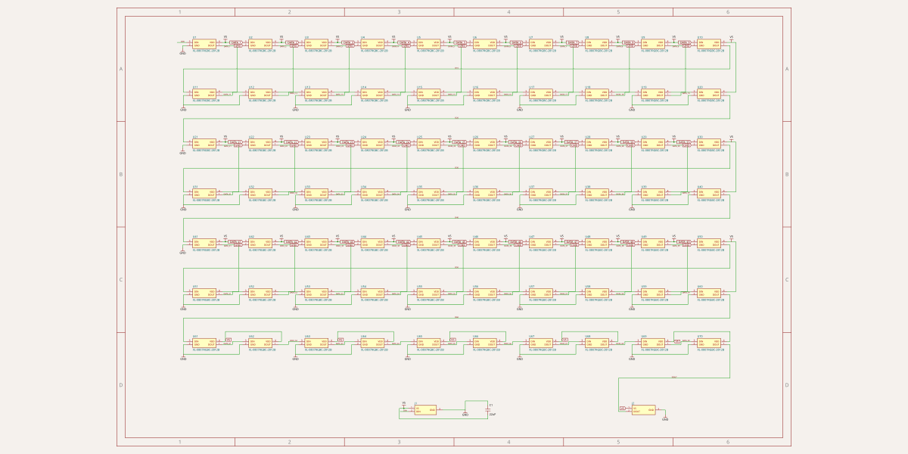
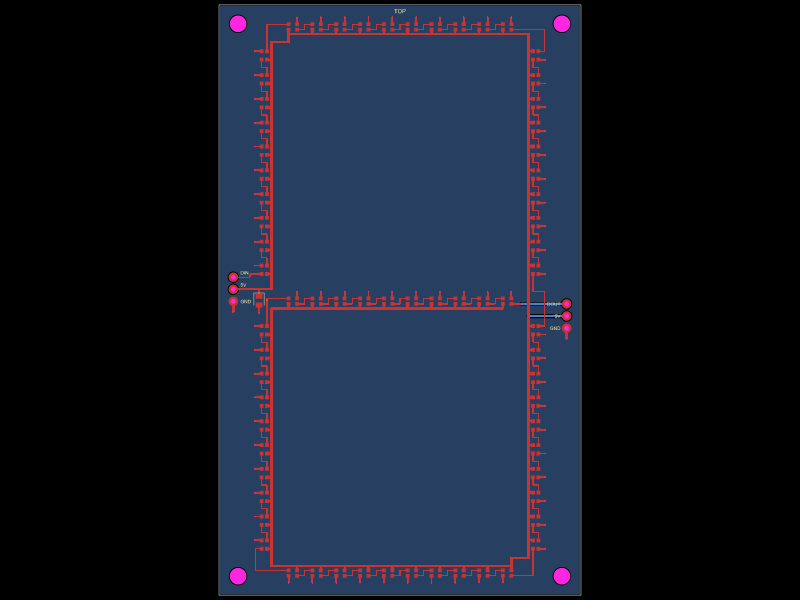
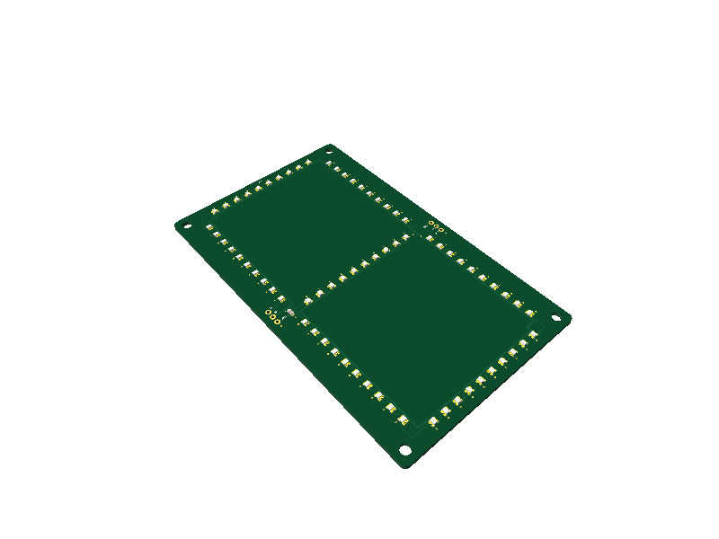
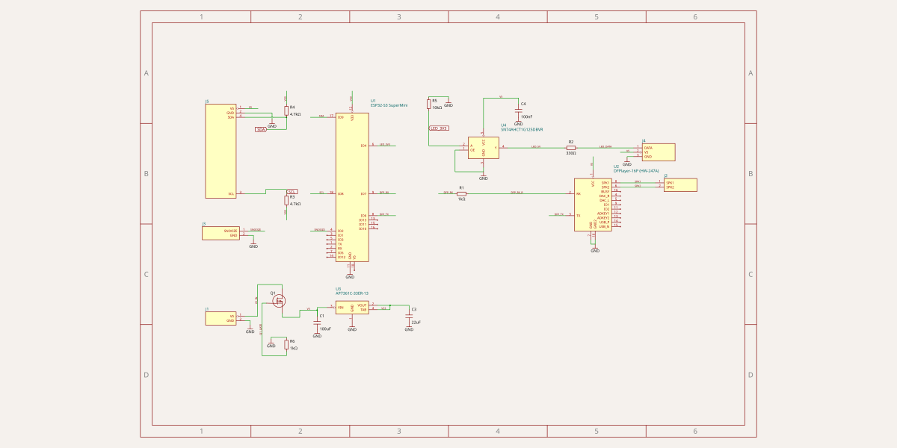
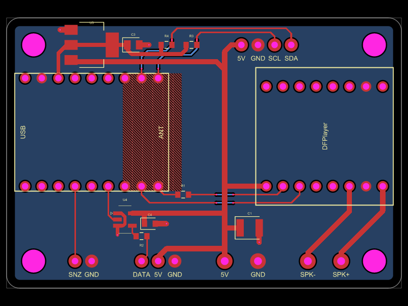
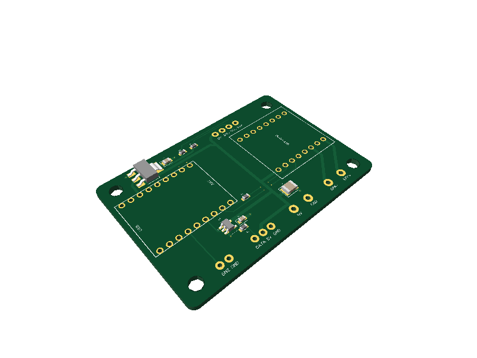

# Bedroom clock

Digit panel (`seven-segment-display.circuit.tsx`):







Controller board (`controller.circuit.tsx`):







A bedroom clock that shows the time in 24 h format on four large 7-segment digits and plays a song as an alarm with slowly rising volume. PCB design written in [tscircuit](https://tscircuit.com) (React/TSX, compiled by the `tsci` CLI). This file is the project doc: the brief (requirements), then design decisions and status, kept current as the design evolves.

## System overview

Two boards:

1. **Digit panel** (this repo, `seven-segment-display.circuit.tsx`): one 7-segment digit. Four identical panels are built into a 3D printed case (hh:mm) and chained with wires: DOUT of one panel to DIN of the next, so all four LED chains form one data line. A digit is 7 segments (bars) of 10 WS2812-type LEDs in a line; a bar is 50 mm long, a digit is about 120 mm high and 62 mm wide (bars separated by ~3 mm gaps, like discrete bars on a sign). Each panel has wire pads on **both side edges**, hand-soldered: DIN, 5V, GND on the left and DOUT, 5V, GND on the right (5V and GND of the two sides are the same nets, so power wires can go to either side). Four 3.5 mm mounting holes sit near the corners and the silkscreen says TOP at the top edge and names every pad.
2. **Controller board** (`controller.circuit.tsx`, 60.31 x 41.28 mm): ESP32-S3 SuperMini dev module at the left edge (USB-C end towards the edge, 1.25 mm edge margin like the DFPlayer; the USB-C connector sits on top of the module, not at the board edge) and the DFPlayer (HW-247A, 16P) next to it on the same baseline, 5V input pads, an AMS1117-3.3 for the ESP32, a 74AHCT1G125 level shifter plus 330 ohm series resistor for the WS2812 data line, speaker pads, a snooze button input and four 3.5 mm corner holes; all connectors are in one row along the bottom edge with equal gaps between the groups. The layout follows the shared rules in [DESIGN.md](https://github.com/agentic-pcb/example-base/blob/main/DESIGN.md) (not copied into this repo). Details under "Controller board" below.

Firmware (not in this repo): custom, web UI written in Svelte and embedded with the `svelteesp32` library, with a Wi-Fi settings portal (time, alarm, song, volume ramp, brightness).

## Status

- Digit panel: **one digit** (70 LEDs) with wire pads on both sides (left DIN/5V/GND, right DOUT/5V/GND, both top to down), four 3.5 mm corner holes pad labels and a TOP mark, 76 x 124 mm; order four of them. `check:wiring:display`, `tsci build` and `tsci check shorts` pass. Fabrication outputs export (BOM: 70 LEDs + 1 capacitor).
- Controller board: **compact design** (`controller.circuit.tsx`, 60.31 x 41.28 mm, connectors on the bottom edge plus four light-sensor wire pads on the top edge), explicitly routed, GND as a bottom copper pour, checked against all 28 rules of [DESIGN.md](https://github.com/agentic-pcb/example-base/blob/main/DESIGN.md) (see "Design rules status (controller)" below: 7 documented exceptions, among them no input capacitor within 3 mm of the AMS1117 VIN pin). `tsc`/eslint/prettier, netlist, schematic-placement, placement, `tsci build` and `tsci check shorts` pass (`npm run check:full:controller`). BOM: 9 SMD parts (C1, C3, C4, U3, U4, R1, R2, R3, R4); the ESP32 module, the DFPlayer and the wire pads are hand-soldered (`doNotPlace`). Not yet verified against the real modules (see Open questions).
- Next: verify the module footprints against the real boards, decide case fit of the holes (Open questions).

## Requirements

- **Purpose:** one 7-segment digit panel built from WS2812-type RGB LEDs (2.0 x 1.8 mm), 10 LEDs per segment, 5 cm segment length, bars not overlapping (horizontals between the vertical columns, verticals between the horizontals, ~3 mm gaps), so about 120 mm digit height, one data chain. Four panels are ordered and built into a 3D printed case; the panels are chained with wires (DOUT to DIN). Brightness/colour set by firmware.
- **Board size / form factor:** one digit per board, 76 x 124 mm with 2 mm rounded corners, 2 layers, all SMD parts on the top side.
- **Power sources and rails:** 5 V only, fed through the 5V and GND wire pads of each panel from the controller board / supply. Current budget: see Design notes.
- **I/O (connectors, headers, mounting holes):** plated wire pads (hand-soldered, no connector) on both side edges, 2.54 mm pitch: `J1` on the left, DIN (top), 5V (middle), GND (bottom); `J2` on the right, DOUT (top, level with the end of the middle bar), 5V (middle), GND (bottom); both sides read data, 5V, GND from top to down. The right pads sit about 5.6 mm lower than the left ones. Left and right 5V/GND are the same nets (wire power to either side). Four 3.5 mm non-plated holes at (+-34, +-58) mm from the board centre. A small `TOP` silkscreen text above the top bar marks the top edge, and every wire pad has its name (DIN, 5V, GND, DOUT) on the silkscreen on its inboard side (on the left the DIN and 5V names sit just above their traces).
- **Mechanical constraints:** the digit outline is fixed by the 5 cm bars: LED rows of the horizontal bars at y = +57.6 / 0 / -57.1 mm (x = -22.5..22.5), vertical bars at x = +-28.5 mm (centre lines), upper LEDs y = 6.6..51.6, lower -51.1..-6.1. Enclosure not defined yet.
- **Manufacturer and constraints:** JLCPCB; basic parts where one exists; Economic assembly (only parts marked "PCBA Type: Economic and Standard", never "Standard Only"; top side only).

### Controller board requirements

- **Purpose:** drive the four chained digit panels (one WS2812 data line, 280 LEDs), play the alarm song through a DFPlayer, take one snooze button, and run the firmware on an ESP32-S3.
- **Board size / form factor:** 60.31 x 41.28 mm with 2 mm rounded corners = about 2490 mm2 (47.5 x 32.5 grid units of 1.27 mm; 13 % smaller than the 64 x 45 mm version, the user asked for 10-20 %), 2 layers, SMD parts on the top side only, GND is a copper pour on the bottom layer. The part coordinates stay on the 1.27 mm grid of [DESIGN.md](https://github.com/agentic-pcb/example-base/blob/main/DESIGN.md), origin = the DFPlayer-side grid, and the board outline is offset by -0.625 mm in x (`outlineOffsetX`, board x = -30.78..29.53 mm): both module outlines are 1.25 mm from their board edge. Four 3.5 mm non-plated holes at (-26.65 / +25.4, +-16.51) mm (equal 4.13 mm from all edges; the right ones and all y are on the grid, the left x is 0.02 mm off). **Every connector (power, LED output, snooze, speaker) is a plated pad in one row along the bottom edge** (y = -16.51 mm, the same line as the lower holes), labelled on the silkscreen on one baseline, in four groups 7.62 mm apart pad centre to pad centre (snooze, LED output, power, speaker). The size follows from the parts: width = ESP32 module 23.5 + DFPlayer 21 + a 13.3 mm corridor between them (5V riser, UART hops, `R1` is left of it; the antenna end of the ESP32 faces it) + 2 x 1.25 mm margins, and it also has to hold the 40.6 mm connector row clear of the holes; height = connector row and level shifter section below the module pins (about 11 mm), the 18/21 mm module bodies, and the AMS1117 section above the ESP32 (about 8 mm).
- **Power:** 5 V only, through two plated solder pads **5.08 mm apart** (`J1`: 5V, GND; 1.2 mm drill, 2.4 mm pad, the same size as the speaker pads: the power class of [DESIGN.md](https://github.com/agentic-pcb/example-base/blob/main/DESIGN.md) rules 5 and 6). A 100 uF bulk capacitor sits at the input right next to `J1` (it also serves as the AMS1117 input capacitor, about 30 mm of 0.8 mm trace away: if the 3V3 rail misbehaves, add a 22 uF capacitor at the AMS1117 input). The ESP32 gets 3.3 V from an AMS1117-3.3 (3V3 pin of the module); the DFPlayer and the level shifter run from 5 V.
- **ESP32:** ESP32-S3 SuperMini (Hestore 10051729), soldered on its header pins at the left board edge, **1.25 mm from it** (the same margin as the DFPlayer; the USB-C connector is on top of the module, so the module does not have to be flush for the plug to be reachable; user: the antenna no longer has to be at the edge). The antenna end points to the board centre; nothing is placed within about 3 mm of it except the two UART lines (1.3 mm below the module edge) and the 5V line (1.7 mm above the pins, 3.4 mm above the module body); the bottom copper pour has a keep-out under the 7 mm antenna end and 2 mm beyond the module end (DESIGN.md rule 16; the 7 mm is an estimate, verify with the real module). The module and the DFPlayer share one baseline: their bottom pin rows (the ones facing the connectors) are at the same y.
- **Level shifting:** the ESP32 data pin (3.3 V) goes through a 74AHCT1G125 (powered from 5 V, VIH about 2 V) and a 330 ohm series resistor to the `LED DATA` pad; the first panel's DIN takes it.
- **Audio:** DFPlayer (Hestore 10038040, HW-247A DFPlayer-16P) on 2 x 8 pin rows; speaker (SPK1/SPK2, mono, up to 3 W) on two solder pads (`J2`, 5.08 mm apart, 1.2 mm drill, 2.4 mm pad).
- **Input:** one button on solder pads (`J3`, two pads labelled `SNZ` and `GND`, 2.54 mm apart, 1.0 mm drill, 2.0 mm pad); the other side of the button goes to GND, the ESP32 uses its internal pull-up.
- **Light sensor (ambient light for the future firmware brightness control):** a GY-302 module (BH1750, [Hestore 10047998](https://www.hestore.hu/prod_10047998.html), 3-5 V on VIN through its own LDO, I2C address 0x23 with ADDR open, 0.12 mA) is wired to four plated solder pads `J5` on the **top edge above the DFPlayer** (same signal pad class as `J3`/`J4`: 2.0 mm pad, 1.0 mm drill, 2.54 mm pitch), in the pin order of the module: 5V, GND, SCL, SDA, so one 4-wire cable fits. SDA = ESP32 IO9, SCL = ESP32 IO8 (any GPIO can be I2C on the S3; these are the free header pins nearest to the pads, firmware: `Wire.begin(9, 8)`, SDA first). Two 4.7 kohm pull-ups to 3V3 (`R3`, `R4`) are on the board, west of the 5V riser above the 5V line.
- **Data and power to the panels:** `J4`, three pads in a row (west to east) in the same order as `J1` of the digit panels: DATA (to DIN of panel 1), 5V, GND, so one 3-wire cable fits. 5V is the board's 5V rail (1 mm trace from `J1`, about 2 A at most); the other panels can be powered from the supply directly (see Open questions).

## Design notes

### Parts

| Ref | Part | JLCPCB | Why |
| --- | --- | --- | --- |
| U1..U70 | XL-0807RGBC-2812B (XINGLIGHT), 2.0 x 1.8 mm, 5 V, WS2812B protocol | C3646929 | Chosen by the user. Economic and Standard, ~58 k in stock. (Other 2020 WS2812 variants such as WS2812C-2020-V1, C2976072, are "Standard Only".) |
| C1 | 22 uF 25 V X5R 0805 | C45783 | Bulk capacitor at the wire entry. Basic, Economic. |
| J1, J2 | 3 plated holes each (1.0 mm drill, 2.0 mm pad, 2.54 mm pitch): J1 DIN/5V/GND on the left edge, J2 DOUT/5V/GND on the right edge | - | Wire pads; `doNotPlace`, not in BOM. |

LED pinout (verified from the EasyEDA symbol/footprint): pin1 DOUT, pin2 GND, pin3 DIN, pin4 VDD; pads 0.8 x 0.8 mm at +-0.889 / +-0.575 mm. The footprint is a local `<footprint>` copied from that part (`lib/Ws2812Led.tsx`), because `jlcpcb:` footprints hit EasyEDA 403 rate limits.

### Digit geometry and data chain

Digit frame: origin = digit centre, x right, y up (the PCB image is in this orientation).

The bars are chained so the data enters at the middle left and leaves at the middle right (good for chaining digits left to right):

| Order | Bar | LEDs | First LED at (x, y) mm | Direction |
| --- | --- | --- | --- | --- |
| 1 | f (upper left) | U1-U10 | (-28.5, 6.6) | up |
| 2 | a (top) | U11-U20 | (-22.5, 57.6) | right |
| 3 | b (upper right) | U21-U30 | (28.5, 51.6) | down |
| 4 | c (lower right) | U31-U40 | (28.5, -6.1) | down |
| 5 | d (bottom) | U41-U50 | (22.5, -57.1) | left |
| 6 | e (lower left) | U51-U60 | (-28.5, -51.1) | up |
| 7 | g (middle) | U61-U70 | (-22.5, 0) | right |

LED pitch 5 mm, so a bar is 10 LEDs over 50 mm. **Firmware segment map** (LED index = U number - 1): a = 10..19, b = 20..29, c = 30..39, d = 40..49, e = 50..59, f = 0..9, g = 60..69. DIN = U1.DIN (J1.DIN), DOUT = U70.DOUT (J1.DOUT, to the next panel's DIN). 70 LEDs x 24 bit at 800 kbit/s = 2.1 ms per frame per digit; four chained panels (280 LEDs) are 8.4 ms per frame, the firmware sees one chain of 280 LEDs, panel 1 first (index = panel * 70 + the digit map above).

### FastLED helper (C++)

`cpp/SevenSegLayout.h` is a header-only helper for the firmware, generated from `lib/ledLayout.ts` (the same module the PCB code uses for the segment order, so the two cannot drift): `npm run export:cpp` (needs Bun on PATH). The whole chain is `CRGB leds[SevenSeg::NUM_LEDS]` (4 x 70 = 280); digit 0 is the panel at the controller (hour tens), digit 3 the last. A segment is 10 consecutive LEDs, so it switches with one `fill_solid`:

```cpp
#include "SevenSegLayout.h"
CRGB leds[SevenSeg::NUM_LEDS];
SevenSeg::setDigit(leds, 2, 7, CRGB::White);               // digit 2 shows a 7 (value 0..9, anything else blanks it)
SevenSeg::setSegment(leds, 0, SevenSeg::SEG_G, CRGB::Red);  // one segment (SEG_A..SEG_G) of digit 0
// firstLed(digit, segment) gives the first LED index; DIGIT_MASK[0..9] holds the lit segments (bit 0 = a ... bit 6 = g)
```

Segments are named a..g (a top, b upper right, c lower right, d bottom, e lower left, f upper left, g middle); their chain order is f, a, b, c, d, e, g (`CHAIN_INDEX`), see the table above. The digit font is the standard one (6 with the top bar, 7 as a-b-c, 9 with the bottom bar); change `DIGIT_SEGMENTS` in `lib/ledLayout.ts` and re-export to alter it. The header compiles warning-free as C++11/C++17 (checked against a minimal FastLED stub, not on a device).

### Power

- 5 V rail on each bar: a 0.5 mm trace on the inner side of the LED row joins the VDD pads; 0.5 mm links join the bars at the corners, following the data chain. The 5V wire pad feeds the start of the chain (U1, bar f) and the other bars are powered in series along the chain, every link following the data order (the 5V links run through the gaps between the bars). Estimated worst-case drop at full white along the whole digit is well below 0.3 V; the firmware limits brightness anyway.
- GND: bottom layer is a solid GND pour (`<copperpour>`), every LED GND pad has its own via (0.3/0.6 mm) next to it; the GND wire pad sits in the pour.
- LED current is **not yet verified** against the XL-0807 datasheet; assuming up to ~20 mA per LED at full white: ~1.4 A per digit, ~5.6 A for four digits. A single 0.5 mm 5V trace carries 1 A at ~10 C rise (1 oz), so the firmware must cap the total brightness (a lit digit at 25 % is ~0.2 A) until the budget is settled, see Open questions.
- Decoupling: only the 22 uF bulk capacitor at the entry (the user decided against a capacitor per LED). If flicker or data glitches show up, a 100 nF per LED is the usual fix; the cells have room below the 5V rail.
- Data: WS2812 inputs need VIH of about 0.7 x VDD (3.5 V at 5 V), so the ESP32 (3.3 V) needs a level shifter (e.g. 74AHCT1G125) plus a ~330 ohm series resistor **on the controller board** (not on this board).

### How the copper is made

The digit is routed explicitly, not by the autorouter (`<board routeRemaining={false}>`), so the pattern is the same for every LED and independent of autorouter luck:

- `lib/LedSegment.tsx`: one bar = 10 LEDs in a row, built with `pcbPath` traces (5V rail, data hop between neighbours, GND via).
- `lib/SevenSegDigit.tsx`: places the 7 bars (LEDs at absolute board positions and rotations; there are no `<group>`s anywhere) and joins them with explicit corner links (`LINKS`). The e to g data link hops under the 5V link on the bottom layer.
- `seven-segment-display.circuit.tsx`: the board, the wire pads J1, the bulk capacitor C1 and their traces. The DOUT trace leaves U70.DOUT on top, hops under the 5V link and the b to c data link on the bottom layer through one via and ends directly at the plated DOUT pad on the right edge (a plated hole is on both layers, so no second via is needed). The right 5V pad J2.V5 is joined to the digit's 5V net the same way: the trace follows the c bar's 5V link up from U31.VDD, drops through a via at x = 27 and runs on the bottom layer under the c bar's data link (x = 30.4) to the pad. DOUT and the right 5V are the only signals on the bottom layer.
- A trace's `pcbPath` points are expressed in the **frame of the component that owns the `from` port** (its position and rotation), not in board or group coordinates. `lib/SevenSegDigit.tsx` converts digit coordinates into that frame (`toLed`).
- A via inside a `pcbPath` needs a wire point at the same spot before and after it (only used at the end of a path here: the GND vias).
- Capacitors also get a default 1 mm "decoupling" max trace length; `C1` sets `maxDecouplingTraceLength`.

### Controller board

Layout rules: see [DESIGN.md](https://github.com/agentic-pcb/example-base/blob/main/DESIGN.md) (shared template repo, not copied here; controller board only, not the digit panel); how the controller meets them: "Design rules status (controller)" below.

**Parts**

| Ref | Part | JLCPCB | Why |
| --- | --- | --- | --- |
| U1 | ESP32-S3 SuperMini, 18 pin header footprint (hand-soldered) | - | Chosen by the user; `doNotPlace`. |
| U2 | DFPlayer-16P (HW-247A), 2 x 8 pin footprint (hand-soldered) | - | Chosen by the user; `doNotPlace`. |
| U3 | AMS1117-3.3, SOT-223 | C6186 | Basic, Economic and Standard; 1 A, plenty for the ESP32-S3 (peak about 0.35-0.5 A with Wi-Fi). |
| U4 | SN74AHCT1G125DBVR, SOT-23-5 | C7484 | 5 V buffer with TTL-level inputs (VIH 2 V), so a 3.3 V GPIO drives it directly; Economic and Standard. Extended part. |
| C1 | 100 uF 16 V X5R 1210 | C394395 | Bulk capacitor ("stabilizer") at the 5 V entry, next to `J1` (its GND pad runs straight to the `J1` GND pad); Economic and Standard. Extended part. |
| C3 | 22 uF 25 V X5R 0805 | C45783 | AMS1117 output capacitor. Basic. (An input capacitor C2 was dropped for lack of room: its courtyard collided with the regulator's; C1 is on the same 0.8 mm 5V line 36 mm away (about 49 mm of trace) and acts as the input capacitor, which breaks DESIGN.md rule 24, see its exception; if the 3V3 rail misbehaves, add a 22 uF capacitor at the regulator input.) |
| C4 | 100 nF X7R 0603 | C14663 | Decoupling at the 74AHCT1G125, 2.4 mm from its VCC pad (DESIGN.md rule 24), GND through a via at the cap. Basic. |
| R1 | 1 kohm 0603 | C21190 | Series resistor in the ESP32 TX to DFPlayer RX line (DFPlayer RX is 3.3 V tolerant but this limits ringing/overcurrent), placed next to the ESP32 pin. Basic. |
| R2 | 330 ohm 0603 | C23138 | Series resistor at the level shifter output, near the source. Basic. |
| R3, R4 | 4.7 kohm 0603 | C23162 | I2C pull-ups (SCL, SDA) to 3V3, 1 % 100 mW; at 3.3 V about 0.7 mA per line when pulled low. Basic, Economic and Standard. |
| J1..J5 | plated wire pads (`doNotPlace`) | - | Power class (2.4 mm pad, 1.2 mm drill, 5.08 mm pitch): `J1` 5V/GND in, `J2` speaker. Signal class (2.0 mm pad, 1.0 mm drill, 2.54 mm pitch): `J3` snooze (`SNZ`, GND), `J4` LED output (DATA, 5V, GND), `J5` BH1750 light sensor (5V, GND, SCL, SDA; top edge). |

All SMD parts were checked on their jlcpcb.com part page: "PCBA Type: Economic and Standard".

**ESP32-S3 SuperMini footprint** (from the vendor drawing, USB-C up): left header row top to bottom TX, RX, IO1..IO7; right row 5V, GND, 3V3, IO13..IO8; 2.54 mm pitch, rows 16.51 mm apart (13 grid units, read off the picture, **verify with a caliper**), pins 1.6 mm from the module ends, module about 23.5 x 18 mm. The module is placed rotated by 90 degrees: the USB-C end faces the left board edge (1.25 mm from it), the antenna end faces the board centre, the TX..IO7 row is the bottom row (facing the connectors) and the 5V/GND/3V3/IO13..IO8 row is the top row. The footprint is a local `<footprint>` with 18 plated holes (1.0 mm drill, 1.6 mm pad, small enough that a 0.4 mm trace fits between two neighbouring pads; the DFPlayer uses the same pad size), no 3D model.

**DFPlayer footprint**: standard DFPlayer Mini layout, left row top to bottom VCC, RX, TX, DAC_R, DAC_L, SPK_2, GND, SPK_1; right row bottom to top IO1, GND, IO2, ADKEY1, ADKEY2, USB+, USB-, BUSY; rows 15.24 mm apart; silkscreen box 21 x 21 mm. The module is placed rotated by 90 degrees so that the left row (VCC at the west end, SPK_1 at the east end) is the bottom row facing the connector edge. Only VCC, RX, TX, SPK_1, SPK_2 and both GND pins are used; BUSY is not connected (dropped to keep the routing simple; the firmware can follow the playback state from the DFPlayer's UART replies).

**Pin plan** (ESP32-S3; no strapping pins used: 0, 3, 45, 46 stay free; USB D+/D- stay free for programming):

| Signal | ESP32 pin | Goes to |
| --- | --- | --- |
| LED data (3.3 V) | IO4 | U4.A (74AHCT1G125) |
| DFPlayer RX line | IO7 | R1 (1 kohm) to U2.RX; firmware: UART TX on IO7 |
| DFPlayer TX line | IO6 | U2.TX; firmware: UART RX on IO6 |
| Snooze | IO2 | J3.SNOOZE (button to GND, internal pull-up) |
| I2C SDA (light sensor) | IO9 | R4 (4.7k to 3V3) and J5.SDA |
| I2C SCL (light sensor) | IO8 | R3 (4.7k to 3V3) and J5.SCL |
| 3V3 | 3V3 | U3 output |
| GND | GND | GND pour (bottom layer) |
| 5V | 5V | not connected |

**Power**: the 5V from `J1` runs entirely on the top layer, 0.8 mm wide, with no via. A riser at the x of the `J1` 5V pad (2.54 mm) goes up the corridor between the modules to a line along y = 13.97 mm that runs west above the ESP32 pins to the AMS1117 input (`U3` sits above the ESP32 so its output is a few mm from the module's 3V3 pin, which is on the top pin row). Branches off the riser: east along y = -5.08 mm to the DFPlayer VCC (the west end of its bottom pin row), the bulk capacitor `C1` right next to `J1`, west along y = -9.21 mm (the VCC pad row of `U4`) to the level shifter VCC and `C4` (which sits right next to the VCC pad, a 0.8 mm stub down to its pin 1), and west along y = -14.6 mm below the level shifter section to the `J4` 5V pad. The AMS1117 tab (VOUT) goes straight to the ESP32 3V3 pin (0.6 mm), the output capacitor `C3` sits right east of the AMS1117 tab (out of the screw circle of the top left hole, DESIGN.md rule 18), 3V3 on its left pad, GND on its right pad through a via; the ESP32 5V pin stays unconnected on purpose (see Decisions). The DFPlayer drives the speaker directly (mono, SPK_1/SPK_2, up to about 3 W at 5 V), so there is no extra amplifier. **GND is a copper pour on the bottom layer** (`<copperpour connectsTo="net.GND" layer="bottom" />`): every through-hole GND pin (`J1`, `J3`, `J4`, the ESP32 GND, both DFPlayer GND pins) touches it directly (a plain `to="net.GND"` trace without a path, nothing to route), and every SMD GND pad has its own GND via to it (DESIGN.md rule 16): `C1`, `U4` GND (0.5 mm; `U4` OE is joined to its GND pad by a 0.5 mm link through the channel between the pad columns, exactly double a signal), `U3`, `C3` and `C4` (five vias, none on 5V or 3V3; see Decisions). The pour stays 1.27 mm from the board edge (rule 26) and has a keep-out under the ESP32 antenna end. Every 5V and GND trace is 0.8 mm wide (user request), signals are 0.25 mm. `tsci check shorts` is clean.

**Routing**: explicit like the digit board (`<board routeRemaining={false}>`, `<trace pcbPath>`, helpers `wire()`/`gndWire()`/`hop()` in the TSX with board coordinates on the 1.27 mm grid (`g(n)`), the frame converter `inFrame` and the pin-position helpers `espAt()`/`dfAt()`). Everything is on the top layer except the pour and the UART hops. Layout: connector row along the bottom edge (west to east: `J3` snooze, `J4` LED output, `J1` power, `J2` speaker); ESP32 on the left (USB-C at the edge), DFPlayer on the right; between them the corridor with the 5V riser. The speaker pins SPK_2/SPK_1 run straight down and then diagonally to `J2`; the level shifter section (`U4`, `C4`, `R2`) is below the ESP32's east half, above `J4`; the AMS1117 section (`U3`, `C3`) is in the strip above the ESP32, next to the module's 3V3/GND pins. The ESP32 bottom row goes straight down (IO2 snooze to `J3`; IO4 LED data runs down and east into the `U4` A pad from the west, the OE/GND link passes through the channel between the pad columns, so the A line does not cross it). IO7 (through `R1`) and IO6, the two easternmost bottom pins, run east just below the module pins at y = -6.35 / -7.62 mm to the DFPlayer RX/TX; both hop under the 5V riser on the bottom layer (a via pair each, vias on signals are allowed). Nothing else crosses a top-layer line.

### Design rules status (controller)

The layout and schematic rules are **not stored in this repo**: they live in one shared file, [DESIGN.md in agentic-pcb/example-base](https://github.com/agentic-pcb/example-base/blob/main/DESIGN.md) (28 rules: alignment 1-13, routing 14-17, mounting 18, schematic 19-20, placement 21-27, outline 28). They apply to the controller board (`controller.circuit.tsx`) only; the digit panel (`seven-segment-display.circuit.tsx`) is exempt because its layout is fixed by the LED geometry in `lib/ledLayout.ts`. This table is the audit of the controller against them (last audited 2026-10-05 against the reread remote file: rule 14 now covers 3V3 too, rule 16 is bottom pour only with GND vias on every top-layer SMD GND pad, edge margin and antenna keep-out; no panel is used for this board, rule 26). Update it after layout changes. Numbers measured from `dist/controller/circuit.json`; board 60.31 x 41.28 mm, grid origin = 0.625 mm right of the board centre (the outline is offset with `outlineOffsetX`), `g(n)` = n x 1.27 mm in the TSX.

| # | Status | How |
| --- | --- | --- |
| 1 | pass | ESP32 and DFPlayer bottom pin rows both at y = -5.08; all connector pads at y = -16.51. `J5` (top edge) is one row at y = +16.51, the line of the upper mounting holes. |
| 2 | exception | Left 2.04 mm (ESP32 pads), right 2.06 mm (DFPlayer pads); both module outlines 1.25 mm. Top 1.08 mm (AMS1117 pad) vs bottom 2.93 mm to the pads (1.64 mm to the label text): the AMS1117 section above the ESP32 cannot move down (see rule 26). |
| 3 | pass | All through-hole pads (module pins, connectors) and the holes are on the 1.27 mm grid (except the two left holes, x = -26.65, 0.02 mm off to keep the 4.13 mm inset equal on both sides); part centres too, except `U1` (centre at a half grid unit, its pins are on the grid) and `C4` (y on the half grid, so its courtyard clears `R2`). |
| 4 | pass | Modules 90 deg; every R, C and IC 0 deg. |
| 5 | pass | Signal connectors (`J3`, `J4`) 2.54 mm pitch, power connectors (`J1`, `J2`) 5.08 mm; 7.62 mm between the nearest pads of two groups. `J5` 2.54 mm pitch (signal class), 7.62 mm span, alone in its row. |
| 6 | pass | Signal pads 2.0 / 1.0 mm, power pads 2.4 / 1.2 mm, all module header pads 1.6 / 1.0 mm. |
| 7 | pass | Pad labels and module texts 1.0 mm on one baseline (y = -18.51); designators 0.5 mm. The `J5` labels sit on their own baseline (y = 14.51, 2 mm below the pads, towards the board interior). |
| 8 | pass | Pad labels all below their pads; no designator over a pad or trace (`U3` moved above its body with `pcbSx`). The silkscreen outlines of `C1`, `C3`, `C4` touch traces (part outlines, kept). |
| 9 | exception | Every connector pad is labelled (`SNZ`, `GND`, `DATA`, `5V`, `GND`, `5V`, `GND`, `SPK+`, `SPK-`). The 34 module header pins carry no label: the modules have their own pin names. `J5` pads `5V`, `GND`, `SCL`, `SDA` are labelled too. |
| 10 | exception | The groups are 7.62 mm apart pad centre to pad centre (the pads stay on the grid), so the pad-edge gaps are 5.6 / 5.4 / 5.2 mm. |
| 11 | pass | 13.3 mm corridor between the modules; the free area above the DFPlayer is the price of the 7 mm AMS1117 strip above the ESP32. |
| 12 | pass | Holes at (-26.65 / +25.4, +-16.51), 4.13 mm from every edge. |
| 13 | pass | Connector row on y = -16.51, the same line as the lower mounting holes; the ESP32 is no longer flush: its outline is 1.25 mm from the left edge, like the DFPlayer on the right (the USB-C connector is on the module top). The sensor pads `J5` form a second edge row on the top edge (pad centres 4.13 mm from the edge, like the bottom row and the mounting holes). |
| 14 | pass | 5V and GND traces 0.8 mm (3.2 x the 0.25 mm signal), 0.5 mm (exactly double) only in the `U4` GND via stub and the OE/GND link between its pad columns. The 3V3 line (0.6 mm, 2.4 x) is covered since the rule covers every supply net: pass. |
| 15 | pass | No via on 5V or 3V3: the 5V and 3V3 run entirely on the top layer. GND vias are not covered. The two UART lines hop under the 5V riser with 4 vias (vias on signals are allowed). `J5` 5V and `R3`/`R4` 3V3 stay on the top layer with no via (the I2C lines add 4 signal vias: 8 in total). |
| 16 | pass | GND is a copper pour on the **bottom layer only**, no top-layer pour. Through-hole GND pins touch the pour directly; every SMD GND pad has a GND via to it: `C1` (via 2.2 mm below its pad), `U4` GND (1.4 mm below), `U3`, `C3`, `C4` (5 vias in total). The pour keeps 1.27 mm from the board edge (`boardEdgeMargin`, measured: outline -29.51..28.26 x +-19.37 on the -30.78..29.53 x +-20.64 board) and has a `<keepout>` on the bottom layer under the ESP32 antenna end: 7 mm of the module plus 2 mm beyond it (x -13.03..-4.03, y -5.83..12.18; the antenna length is an estimate, verify with the real module). |
| 17 | pass | Every corner is two 45 degree bends, written with `chamfer()`/`wire45()` in `controller.circuit.tsx` (cut 1.27 mm, smaller where a pad is close: 0.9 mm at the UART pins, 0.7 / 0.5 mm at the `U4` pads, 0.3 mm in the `U4` channel between its pad columns). Measured on `dist/controller/circuit.json`: the only 90 degree turns left are T junctions on the 5V riser (`V5` branches, `V5_C4`) and the end of the `U3` VIN feed inside its pad (0.24 mm jog). `SPK1`/`SPK2` were already exact 45 degree diagonals. Vias unchanged (rows 15 and 16). |
| 18 | pass | Free circle r = 3 mm around each hole centre, measured from `circuit.json`: nearest pad edge is 3.47 mm from the top left centre (`U3` pins), 3.88 mm bottom right (`J2`), 4.08 mm bottom left (`J3`), 5.68 mm top right; the DFPlayer silkscreen outline is 3.47 mm from the top right centre. `C3` was inside the top left circle and moved east of `U3`. Only traces run through the circles (3V3 and `U3` GND around the top left hole). `J5`, `R3`, `R4` are outside every circle (nearest: `SDA` pad 12.7 mm from the top right hole centre). |
| 19 | pass | Five sections on the one sheet `Controller`: MCU (`U1`), Power (`J1`, `C1`, `U3`, `C3`), LED output (`U4`, `C4`, `R2`, `J4`), Audio (`U2`, `R1`, `J2`), Input (`J3`); each block clustered, with a gap to the next. |
| 20 | pass | Left: `J1` power in, `J3` snooze; middle: `U1` (IO2 snooze in on the left; IO4, IO7, IO6 out on the right; V33 on top, GND and V5 below); right: the LED chain `U4` > `R2` > `J4` (top) and `R1` > `U2` > `J2` (bottom). |
| 21 | pass | Fixed first: both modules (`U1`, `U2`), the connector row on the bottom edge and the 5V riser from `J1`; then `U3`/`C3` (next to the 3V3 pin), `U4`/`C4`/`R2` (next to its connector `J4`) and `R1` (near its source pin). |
| 22 | exception | The power parts are split: the entry (`J1`, `C1`) at the bottom, the regulator (`U3`, `C3`) above the ESP32, because the module's 3V3 pin is on its top pin row and the 5V riser connects the two (rule 11, README Decisions). The level shifter section (`U4`, `C4`, `R2`, `J4`) and the audio parts are together. |
| 23 | pass | Digital left (`U1`, level shifter, snooze, LED output), audio right (`U2`, speaker pads), the 5V riser between them, the regulator top left. The speaker lines leave the DFPlayer at its east end and the UART lines at its west end, so they never run alongside each other; the UART lines hop under the riser. No analog circuit besides the DFPlayer speaker output. |
| 24 | exception | `U4` VCC: `C4` is 2.4 mm away (pad centre to pad centre), 5V stub 0.8 mm, GND through a via at the cap (was 5.7 mm, moved). `U3` VOUT: `C3` is 2.3 mm from the tab, 0.6 mm 3V3. **`U3` VIN has no capacitor within 3 mm:** `C1` (100 uF) is 36 mm away (about 49 mm of 0.8 mm trace); the strip above the ESP32 has no room next to the VIN pad (hole circle, ESP32 pads, 5V line). If the 3V3 rail misbehaves, a 22 uF capacitor at VIN needs a taller board or another regulator package. |
| 25 | n/a | No crystal on the board (the modules carry their own). |
| 26 | exception | Pads and SMD parts: `U3` GND pad 1.08 mm from the top edge (0.19 mm short, same cause as rule 2); the ESP32 23.5 mm outline is 1.25 mm from the left edge and the DFPlayer 21 mm outline 1.25 mm from the right edge (0.02 mm short each, nominal vendor outlines; their pads are 2.04 / 2.06 mm); the connector pads are 2.93 mm and the pad labels 1.64 mm from the bottom edge, everything else further. The pour is 1.27 mm from the edge (rule 16). No panel is used (routed tabs would need 5 mm). |
| 27 | exception | Only `U3` (AMS1117, SOT-223) is warm: (5 V - 3.3 V) x the ESP32-S3 draw of roughly 0.1-0.2 A typical (Wi-Fi bursts above 0.3 A) is about 0.2-0.35 W (an estimate, not measured). Its tab is a 2 x 3.8 mm pad with a 0.6 mm trace, in the open top left corner; there is no dedicated pour or thermal via (the bottom layer is the GND pour, so the VOUT tab cannot use it). If the regulator runs hot: add a V33 `copperpour` with an `outline` round the tab on the top layer. |
| 28 | pass | `<board borderRadius="2mm">` gives every outer corner a 2 mm radius. The nearest pad, hole, via or label to a corner arc centre is about 7 mm away (measured from `circuit.json`), so everything is far over the 1.27 mm clearance from the curve; the four mounting holes are 4.13 mm from the edges. |

## Decisions

- **2 mm rounded board corners** (user request) on both boards: `borderRadius="2mm"` on `<board>`. The GND pours got `boardEdgeMargin="0.25mm"`: with the rounded outline the 0.2 mm default fails the copper-to-board-edge check by rounding (measured 0.200, required 0.200). The case needs matching 2 mm corner radii.
- **LED part:** user's choice, C3646929 (Economic assembly OK). Local footprint; 3D model: the EasyEDA model of C3646929 via modelcdn (`objUrl`).
- **No per-LED capacitor** (user decision): a bar is just 10 LEDs. Only a 22 uF bulk capacitor at the entry.
- **One data chain through all LEDs** of all panels: DIN of the first panel from the controller, then DOUT to DIN between panels.
- **Two layers, top-side parts only** to keep Economic assembly and a cheap board; GND on the bottom pour instead of a second 5V/GND layer pair. Rejected: 4 layers (cost, not needed for the current budget).
- **Explicit routing** instead of the autorouter: the autorouter produced tangled, uneven copper and tried to connect GND pad to pad on top.
- **Bars like discrete bars with gaps** (user, from a photo of a laser-cut board with separate bar PCBs): no shared corners, ~3 mm gaps, so the corner links pass through the gap and nothing collides. Replaces the first version where the vertical bars ran into the horizontal rows (100 mm figure-8). Costs height: ~120 mm instead of 100 mm.
- **Chain order f-a-b-c-d-e-g** instead of alphabetical, so DIN and DOUT are both at mid height on the left/right.
- **5V link b to c stays on top**; it blocks the straight exit of U70.DOUT to the next digit, which will hop under it on the bottom layer when the digits are chained.
- **Solder pads, no connector** for the wire entry (user decision).
- **5V and GND pads on both sides** (user, to ease wiring): the right side J2 repeats 5V/GND next to DOUT. Rejected: all pads on the bottom edge (user said left and right sides).
- **One panel per board, four boards** instead of one four-digit board (user decision): the panels are mounted in a 3D printed case and chained with wires. Each has pads DIN, 5V, GND on the left and DOUT, 5V, GND on the right (user: "left and right sides", same order top to down on both sides, easy wiring; a bottom-edge pad row was rejected).
- **Controller: ESP32 USB-C end towards the left edge with a 1.25 mm margin, antenna towards the centre** (user: the antenna need not be at the edge, and the module must not sit on the real board edge, its USB-C connector is on the module top; this replaces the earlier antenna-at-the-edge decision and the flush placement). Consequence: the module's 5V/GND/3V3 pins are now on the top row (away from the connectors), so the AMS1117 moved into the strip above the module and its 5V comes up a top-layer riser in the corridor between the modules (the two UART lines hop under it). Rejected: ESP32 on the right with USB at the right edge and the DFPlayer on the left (the power pins would be on the bottom row, but the UART lines would have to cross the speaker pins and the DFPlayer VCC would be at the far end from the supply); the UART through the pad gaps.
- **Controller: AMS1117-3.3 feeds the ESP32 3V3 pin, the 5V pin stays unconnected** (user asked for a separate 3.3 V power chip). Consequence: with USB plugged in, the module's own regulator and the AMS1117 are in parallel on 3V3 (usual for dev boards); the 5 V rail is not backfed from USB through the 5V pin. Rejected: powering the module from its 5V pin (would not need U3, but the user asked for the chip).
- **Controller: DFPlayer without amplifier**: it drives a mono speaker (up to 3 W) directly from SPK_1/SPK_2; DAC outputs unused.
- **Controller: 5 V power pads 5.08 mm apart, 1.2 mm drill, 2.4 mm pad** (user: "solder pins only 5 mm distance", then DESIGN.md rules 5 and 6: one pitch and one pad size per function, so `J1` follows the speaker pads `J2`; 5 mm was 3 mm pad / 1.5 mm drill), bulk capacitor 100 uF at the entry, moved next to `J1` so its GND reaches the `J1` GND pad without a via.
- **Controller: LED output pads `J4` = DATA, 5V, GND** (user: 5V next to DATA and GND for easy wiring, same order as the digit panel pads). The 5V pad is on the board's 5V rail, which is a 0.8 mm trace from `J1`: fine for panel 1 (about 1.4 A at full white) but not for all four panels at full brightness, so power the other panels from the supply (or cap the brightness in firmware).
- **Controller: explicit routing, all signals and power on the top layer, GND as a bottom copper pour** (DESIGN.md rule 15 then read "no vias on 5V/GND"; it is now 5V only and the pour is rule 16; this reverses the earlier "no pour, GND as a bottom-layer tree with a via per pin" decision). Why: tscircuit starts an explicit trace on the top layer even at a through-hole pad, so every bottom-layer GND branch needed a via (12 GND vias and 3 on 5V before); with the pour the through-hole GND pins join it directly and the SMD GND pins get a GND via (first run on the top layer to a through-hole GND pad; changed 2026-10-05 when DESIGN.md rule 16 required GND vias for top-layer GND pads: `C1` and `U4` now have a via instead of a 20-40 mm top-layer GND trace). Result: no via on 5V or 3V3, five on GND (`C1` and `U4` GND: rule 16; `U3` GND: its way to the ESP32 GND pin would cross the 3V3 line; `C3` GND: the cap had to leave the top left screw circle, DESIGN.md rule 18, and cannot reach the ESP32 GND pin on one layer; `C4` GND: the cap had to sit next to `U4` VCC, DESIGN.md rule 24, 6.4 mm from the nearest GND pad), four on signals (the two UART lines hop under the 5V riser). Rejected: the autorouter (tangled GND pad-to-pad traces, long diagonals); keeping the via-per-pin tree. The pour also gives a low-impedance return for the DFPlayer speaker current (up to ~0.9 A peaks), the WS2812 data line and the ESP32 Wi-Fi bursts. The pour keeps 1.27 mm from the board edge and has a keep-out under the ESP32 antenna end (rules 16 and 26).
- **Controller: 1.27 mm grid, board 60.31 x 41.28 mm** (DESIGN.md rule 3): every pad and module pin is on the grid; the board was 59.06 mm wide with the ESP32 flush with the left edge, and was widened by 1.25 mm on the left (the edge moved, no part did) so the ESP32 outline has the DFPlayer's 1.25 mm edge margin. Holes at (-26.65 / +25.4, +-16.51), equal 4.13 mm inset, the lower holes on the line of the connector row. Rejected: moving the ESP32 one grid unit right (the 13.3 mm corridor with the 5V riser and the UART hops would shrink to 12 mm and every ESP wire would change); 60.33 mm (all holes on the grid, but a 1.27 mm margin that differs from the DFPlayer's).
- **Controller: connectors in two classes** (rules 5 and 6): signal pads (`J3`, `J4`) 2.0 / 1.0 mm at 2.54 mm pitch, power pads (`J1`, `J2`) 2.4 / 1.2 mm at 5.08 mm pitch; header pads of both modules 1.6 / 1.0 mm; the groups are 7.62 mm apart (pad centre to pad centre, so the pads stay on the grid). The snooze pad is labelled `SNZ` so two labels fit on the 2.54 mm pitch.
- **Controller: part orientation** (rule 4): modules rotated 90 deg, every R, C and IC at 0 deg; `C3` has its pin 1 on 3V3 (left, at the AMS1117 tab) and pin 2 on GND (right, via).
- **Controller: light-sensor pads `J5` on the top edge above the DFPlayer, I2C pull-ups on the board** (user: wire a GY-302/BH1750 to four solder pads for the future brightness control). The bottom edge has no 4-pad gap, the left and right edges are filled by the module pins, so the free strip above the DFPlayer (top edge row, y = +16.51) is used; the board size and case outline stay the same. Pad order 5V, GND, SCL, SDA as on the GY-302 header. 5V is a chamfered continuation of the riser (top layer, 0.8 mm, no via); GND joins the pour through the pad. SDA = IO9, SCL = IO8: any GPIO can be I2C on the S3, these are the free header pins nearest to `J5`; the pair is swapped against the Arduino defaults (SDA 8, SCL 9) so the two lanes above the pad row cross nothing, firmware uses `Wire.begin(9, 8)`. Each line hops under the 5V line on the bottom layer (vias on signals are allowed), runs east under the pull-ups and surfaces at its pull-up pad `R4` (SDA) / `R3` (SCL); then two lanes above the pad row (SCL the lower one, 18.4 mm, SDA the upper one, 19.05 mm) drop onto the `J5` pads. Pull-ups 4.7 kohm to 3V3 (user choice: on the board, because the GY-302 pull-up wiring is unknown; parallel module pull-ups are harmless at 100 kHz). Rejected: widening the board for pads on the right edge or the bottom row (case change), pads at the end of the bottom row (no room), pull-ups only in the firmware (about 45 kohm internal, unverified).
- **Controller: modules hand-soldered, `doNotPlace`** (ESP32 module, DFPlayer, wire pads); the JLCPCB BOM only has the 7 SMD parts.

## Open questions / TODO

- Verify the LED current per colour from the XL-0807RGBC-2812B datasheet and set the real power budget (supply size, trunk width, firmware brightness cap).
- Case fit of the 3.5 mm corner holes (4 mm inset from the edges) and the pads, diffuser; optional colon dots (24 h clock) as a separate small board.
- 5V and GND are wired to each panel separately (only DIN/DOUT are chained): one panel draws up to ~1.4 A, so use a thicker wire per pad and a 5V supply sized for ~5.6 A with a brightness cap.
- Check the LED rotation in the JLCPCB assembly preview before ordering (`tsci export` warns "cannot verify jlcpcb pick-and-place rotation"; the LEDs are exported at 270 deg / 180 deg depending on the bar).
- Controller: **verify the module footprints against the real boards** (ESP32-S3 SuperMini row spacing 16.5 mm and pin positions were read off a picture; DFPlayer HW-247A pinout and 15.24 mm row spacing are the standard DFPlayer Mini values, not measured). Print the board at 1:1 and hold the modules against it before ordering.
- Controller: DFPlayer microSD slot orientation/access (which side is the slot on, can a card be changed with the module soldered in place?); the footprint just has a 21 x 21 mm outline. The DFPlayer and the ESP32 have no 3D model (custom footprints), so the 3D picture shows only the SMD parts.
- Controller: the 3 J2/J1/J4 connector warnings ("not in accessible orientation") are informational (wire pads, no insertion direction).
- Controller: the board is compact on purpose: clearances are 0.2-0.5 mm in places; check the USB plug and the DFPlayer SD card fit in the case (the board is 1.06 mm wider and 0.28 mm taller than the previous 58 x 41 mm version, so re-check the case fit). The antenna end of the ESP32 sits in the board interior; the UART lines pass 1.3 mm below the module edge and the 5V line 3.4 mm above it, and the bottom GND pour has a keep-out there (7 mm of the module plus 2 mm beyond; the antenna length is an estimate, check it against the real module). If Wi-Fi range is poor, enlarge the keep-out (`ANT_LEN` in `controller.circuit.tsx`) or move the 5V line further up.
- Controller: DESIGN.md schematic and placement rules (now 19-27) were added: the schematic now reads inputs left, MCU middle, outputs right, `C4` moved next to `U4` VCC. Open: `U3` VIN has no capacitor within 3 mm (rule 24), the top edge is 1.08 mm from the `U3` GND pad (rule 26), and the AMS1117 has no dedicated heat copper (rule 27).
- Controller: DESIGN.md rule 17 (no 90 degree corners, T junctions allowed) was added: every corner of the explicit copper is two 45 degree bends (`chamfer()`/`wire45()` in `controller.circuit.tsx`); vias and the GND pour are unchanged.
- Controller: all four screw heads (5.5 mm) now have a free 6 mm circle (DESIGN.md rule 18); `C3` moved east of `U3` for it and needs a GND via (see the rule 16 row). If the 3V3 rail needs a capacitor right at the ESP32 pins, check the SuperMini's own capacitors first.
- Controller: light sensor `J5` (GY-302 / BH1750): **check on the real module whether its SDA/SCL pull-ups go to its 3.3 V LDO output or to VIN** before connecting it with 5 V on VIN: if they pull up to 5 V the ESP32 pins (3.3 V only) would see 5 V; then power the module from 3V3 instead or remove its pull-ups. Firmware (not in this repo yet): `Wire.begin(9, 8)` (SDA 9, SCL 8), BH1750 address 0x23 (0x5C with ADDR high), continuous high-resolution mode 0x10, smooth the lux value before mapping it to the LED brightness. The module's built-in WS2812 status LED is on GPIO48 (the Waveshare ESP32-S3-Zero pin picture shows GP21, that is that board, not this one). The sensor must look at the room, not at the LEDs (case window or a light shield on the cable end).
- Controller: ESP32 5V pin is unconnected; if the board should also be powered by USB alone, add a Schottky from the 5 V rail instead (open).
- Controller: firmware UART on IO7 (TX) / IO6 (RX), LED data on IO4, snooze on IO2 with INPUT_PULLUP (remap in the firmware); add an RC debounce or do it in the firmware.

## Finding JLCPCB parts

Query the [jlcsearch](https://jlcsearch.tscircuit.com/) JSON API (e.g. `leds/list.json`, `led_with_ic/list.json`, `capacitors/list.json`, `components/list.json?search=...`). Prefer basic parts (`is_basic=true`) and pick the highest stock. Then open the part page (`https://jlcpcb.com/partdetail/C<number>`) and confirm it says `PCBA Type: Economic and Standard`; jlcsearch does not expose this flag. Record the chosen part as `supplierPartNumbers={{ jlcpcb: ["C..."] }}` in the TSX. Also browse [tscircuit datasheets](https://tscircuit.com/datasheets).

## Setup

Requires Node and [Bun](https://bun.sh) (`tsci` runs under Bun; make sure `~/.bun/bin` is on PATH).

```bash
npm install
npm start              # tsci dev: interactive preview
# every board script exists twice, :display (seven-segment-display.circuit.tsx) and :controller (controller.circuit.tsx)
npm run check:full:display        # tsc + eslint + prettier + netlist + schematic placement + build + shorts check (check:wiring:<board> stops before the build)
npm run check:full:controller
npx tsci snapshot -u              # regenerate the schematic and PCB SVG snapshots of both boards (the schematics are embedded at the top of this README)
npm run export:images:display     # rebuild and refresh docs/images/display-{pcb,3d}.png (embedded at the top of this README)
npm run export:images:controller  # docs/images/controller-{pcb,3d}.png
npm run export:gerbers:display    # dist/gerbers-display.zip with Gerbers, drill, bom.csv, pick_and_place.csv
npm run export:gerbers:controller # dist/gerbers-controller.zip
npm run export:cpp                # cpp/SevenSegLayout.h, the FastLED helper (needs Bun)
npm run update:skill   # re-install the latest tscircuit AI skill into .claude/skills/tscircuit/
```

Before sharing or fabricating, work through the checks in order: `tsci check netlist`, `schematic-placement`, `placement`, `routing-difficulty` (informative only here, the digit is routed explicitly), then `tsci build`, then `tsci check shorts`. See `.claude/skills/tscircuit/CHECKLIST.md` for the pre-fab checklist.

## References

- [tscircuit docs](https://docs.tscircuit.com/); the full docs are also available as one text file at https://docs.tscircuit.com/llms.txt
- [DESIGN.md](https://github.com/agentic-pcb/example-base/blob/main/DESIGN.md): PCB layout and schematic rules, shared in the template repo `agentic-pcb/example-base` (not copied; applied to the controller board only)
- [tscircuit datasheets](https://tscircuit.com/datasheets)
- [jlcsearch](https://jlcsearch.tscircuit.com/)
- AI skill: [tscircuit/skill](https://github.com/tscircuit/skill), installed in `.claude/skills/tscircuit/`
- Controller: DESIGN.md reread 2026-10-05: rule 14 now covers every supply net (3V3 is 0.6 mm, passes), rule 16 needs GND vias on top-layer GND pads, a pour margin of rule 26 (1.27 mm) and no pour under an antenna. `C1` and `U4` got GND vias (their long top-layer GND traces to `J1`/`J3` are gone), the pour margin went from 0.25 to 1.27 mm and the bottom pour has an antenna keep-out.
- Controller: DESIGN.md rule 28 (2 mm board corner radius) was added: already met (`borderRadius="2mm"`), audit row added.
